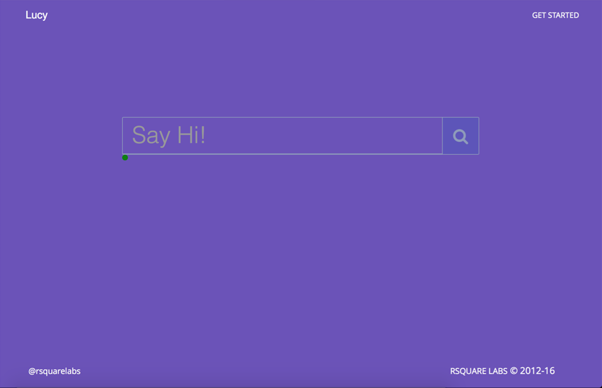

# Lucy - Personal Research Assistant

This is a sub project for developing a personal research assistant for RSQUARE LABS. The core idea of the Lucy is to learn from the research by individual research users and help the same user or other users based on the collective intelligence aggregated from every user, in the same research activities or concepts. It is also aimed at redefining the way notifications are sent to the users with in the application as well as other forms which include emails, push notifications.

Consider the Lucy as a baby, and all forms of intelligence must be taught to it, so that it gains knowledge and helps others with same issue. All the versions of the Lucy are named as age of a baby, cause our developers raise the lucy with the code by adding intelligence to it.  





# Installation

```
# clone the repository
git clone https://github.com/rsquarelabs/lucy.git
# create a virtual environment
virtualenv venv
# activate the virtual environment
source venv/bin/activate
# install the required packages
pip install -r requirements.txt
# starting the server
python manage.py runserver
```

# How to teach Lucy
